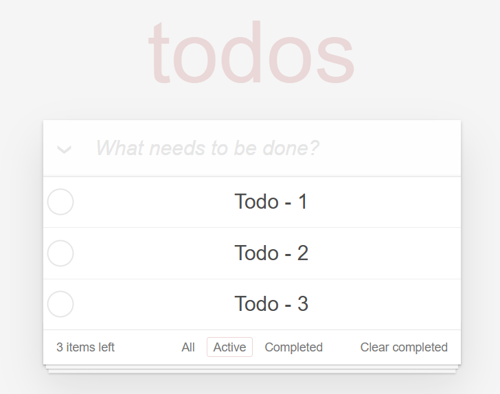

# 📝 Todo App | React + Vite

[🇹🇷 Click for Turkish README](./README.tr.md)

*Created on: April 26, 2025*

A simple and user-friendly todo application built with React and Vite.
* This project was developed as **Week-12 - Assignment-1 | Todo App** for the Patika Frontend Bootcamp.
* It features basic todo management and filtering functionality.
* **React**, **Vite**, **CSS3**, and **LocalStorage** are used.
* State management is handled with React Hooks.

---

## 🌐 Live Demo

Visit the live site : [Todo App | React](https://todo-app-reactjs-flame.vercel.app/)

---

## :computer: Installation and Usage

1. Clone the repository:
```bash
git clone https://github.com/tunahanyasar/todo-app-reactjs.git
```

2. Navigate to the project folder:
```bash
cd todo-app-reactjs
```

3. Install dependencies:
```bash
npm install
```

4. Start the development server:
```bash
npm run dev
```

Open your browser and go to `http://localhost:5173` to view the app.

---

## 🗂️ Project Structure

```
todo-app-reactjs/
│
├─ src/
│   ├─ components/
│   │   ├─ TodoApp.jsx
│   │   ├─ TodoList.jsx
│   │   ├─ TodoItem.jsx
│   │   ├─ TodoForm.jsx
│   │   └─ TodoFilter.jsx
│   ├─ assets/
│   │   └─ screenshots/
│   │       ├─ fullpage.png
│   │       ├─ active-todo.png
│   │       ├─ complated-todo.png
│   │       └─ edit-todo.png
│   ├─ App.jsx
│   ├─ App.css
│   ├─ index.css
│   └─ main.jsx
├─ index.html
├─ package.json
└─ ...
```

### File & Folder Explanations

- **/src/components/**
  - **TodoApp.jsx:** Main app component, handles state and core logic.
  - **TodoList.jsx:** Manages and displays the todo list.
  - **TodoItem.jsx:** Represents a single todo item.
  - **TodoForm.jsx:** Form for adding new todos.
  - **TodoFilter.jsx:** Handles filtering operations.
- **/src/assets/screenshots/**: Screenshots of the app.
- **App.jsx:** Main application component.
- **main.jsx:** Entry point for the React app.
- **index.css & App.css:** All style files.
- **index.html:** Main HTML file for the app.
- **package.json:** Project dependencies and scripts.

---

## :star2: Main Features

1. **Todo Operations**
   - Add todo
   - Delete todo
   - Edit todo
   See: [Edit Todos](#edit-todos)
   - Mark as completed
   - Bulk complete/undo

2. **Filtering Operations**
   - View all todos
   See: [All Todos](#fullpage)
   - Filter active todos
   See: [Active Todos](#active-todos)
   - Filter completed todos
   See: [Completed Todos](#completed-todos)
   - Bulk delete completed todos

3. **Modern UI/UX**
   - User-friendly interface
   - Responsive design
   - Clean and organized codebase

---

## 💡 Technologies & Concepts

**React:**
* Component Architecture
* Props System
* React Hooks (useState, useEffect)
* Event Handling
* Conditional Rendering

**CSS:**
* Flexbox Layout
* CSS Grid
* Transform & Transitions
* Responsive Design
* Custom Properties

**JavaScript:**
* ES6+ Features
* Array Methods
* LocalStorage Management
* Event Handling
* State Management

---
# :paperclip: Screenshots

### Fullpage


### Active Todos


### Completed Todos


### Edit Todos


---

## 🎮 How to Use

1. Add a Todo:
   - Type your task in the input field
   - Press Enter or click the add button

2. Todo Operations:
   - Click the checkbox to mark as completed
   - Double-click to edit
   - Click the X button to delete

3. Filtering:
   - All: Shows all todos
   - Active: Shows uncompleted todos
   - Completed: Shows completed todos

4. Bulk Operations:
   - Clear completed: Deletes all completed todos

---

## 🔍 Detailed Explanation

### Project Purpose & Scope

This project is a simple and user-friendly todo application that allows users to easily manage their daily tasks. It features a modern UI built with React.

### Technical Details

#### TodoApp.jsx - Main App Component

**TodoApp.jsx** is the main component of the application and includes the following key functions:

1. **State Management:**
   - Manages todos and filter state with useState hooks
   - Integrates with LocalStorage using useEffect

2. **Layout Structure:**
   - Header and form at the top
   - Todo list in the middle
   - Filtering and bulk actions at the bottom
   - Responsive design with CSS Grid and Flexbox

#### User Experience
- **Visual Feedback:** Visual cues when adding or deleting todos
- **Easy Editing:** Double-click to quickly edit
- **Filtering:** Instant access with real-time filtering
- **Data Persistence:** Todos are saved with LocalStorage

---

## 👤 Contact

[Tunahan Yaşar](https://github.com/tunahanyasar)

[LinkedIn](https://www.linkedin.com/in/tunahan-yasar/)

---

## 📚 References & Credits

This project is based on [Mehmet Seven](https://codepen.io/mehmetseven)'s [Todo App](https://codepen.io/mehmetseven/pen/OJRzLjV). The original design was adapted from [Dmitry Sharabin](https://codepen.io/dmitrysharabin)'s [Todo App](https://codepen.io/dmitrysharabin/pen/MWgQNYZ) and rebuilt using React + Vite. 
