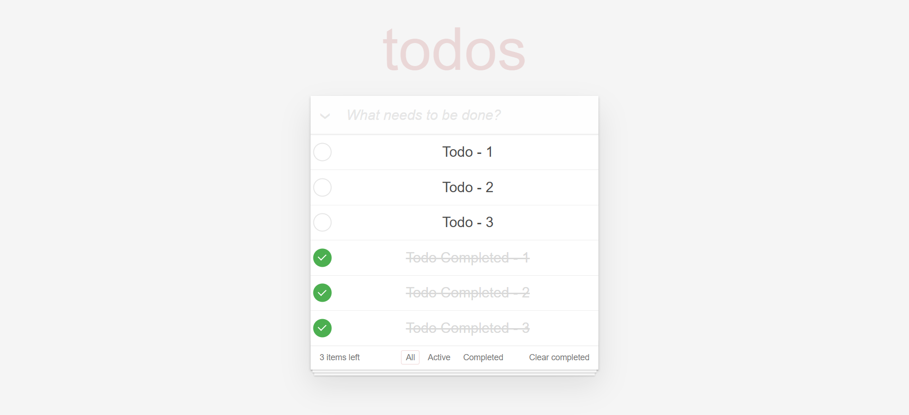
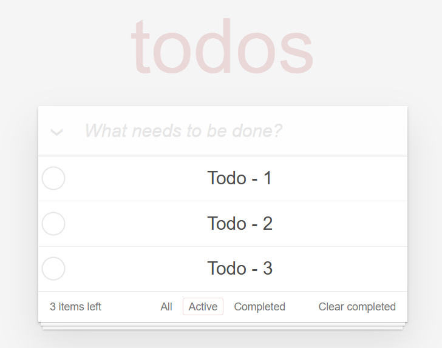
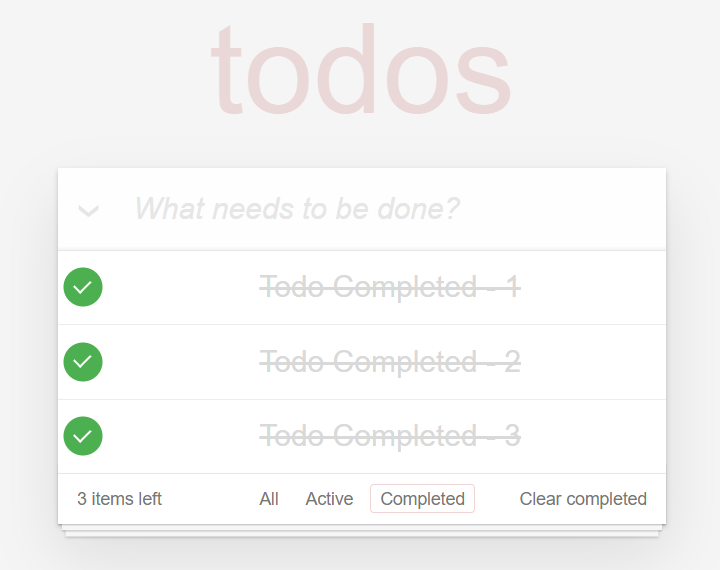
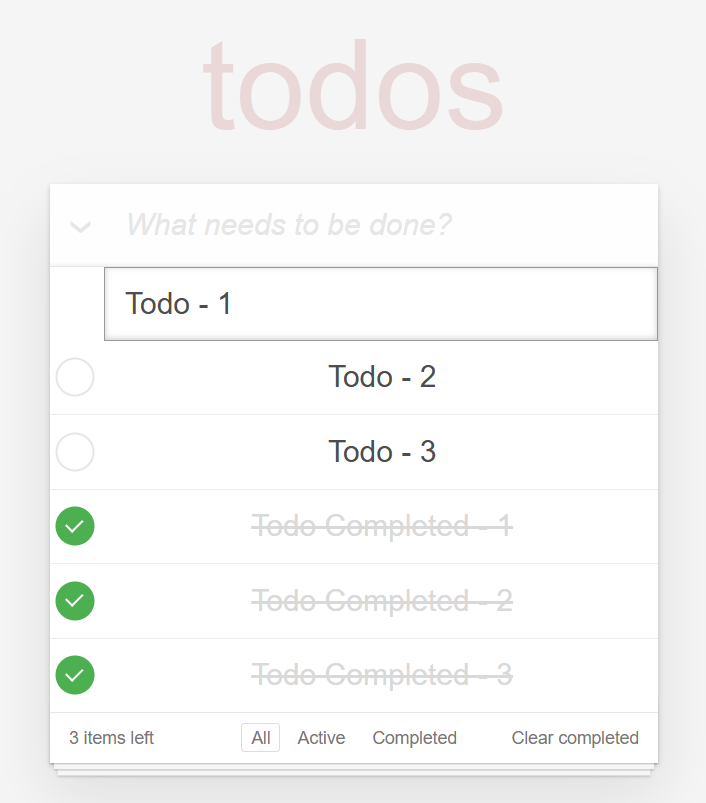

# 📝 Todo App | React + Vite

[🇬🇧 İngilizce README için tıklayın](./README.md)

*Oluşturulma Tarihi : 26 Nisan 2025*

Basit ve kullanıcı dostu bir todo uygulamasıdır. React ve Vite kullanılarak geliştirilmiştir.
* Bu proje, Patika Frontend Bootcamp'i için oluşturulan **Hafta-12 - Odev-1 | Todo App** projesidir.
* Temel todo yönetimi ve filtreleme işlevselliğine sahip bir uygulamadır.
* **React**, **Vite**, **CSS3** ve **LocalStorage** kullanılmıştır.
* React Hooks ile state yönetimi sağlanmıştır.

---

## 🌐 Canlı Demo

Canlı siteyi ziyaret edin : [Todo App | React](https://todo-app-reactjs-flame.vercel.app/)

---
## :computer: Kurulum ve Kullanım

1. Repoyu klonlayın:
```bash
git clone https://github.com/tunahanyasar/todo-app-reactjs.git
```

2. Proje klasörüne gidin:
```bash
cd todo-app-reactjs
```

3. Bağımlılıkları yükleyin:
```bash
npm install
```

4. Geliştirme sunucusunu başlatın:
```bash
npm run dev
```

Uygulamayı açmak için tarayıcınızda `http://localhost:5173` adresine gidin.

---

## 🎮 Nasıl Kullanılır?

1. Todo Ekleme:
   - Input alanına görev yazın
   - Enter tuşuna basın veya ekle butonuna tıklayın

2. Todo İşlemleri:
   - Tamamlamak için checkbox'a tıklayın
   - Düzenlemek için çift tıklayın
   - Silmek için X butonuna tıklayın

3. Filtreleme:
   - All: Tüm todoları gösterir
   - Active: Tamamlanmamış todoları gösterir
   - Completed: Tamamlanmış todoları gösterir

4. Toplu İşlemler:
   - Clear completed: Tamamlanmış todoları sil
---

## 🗂️ Proje Yapısı

```
todo-app-reactjs/
│
├─ src/
│   ├─ components/
│   │   ├─ TodoApp.jsx
│   │   ├─ TodoList.jsx
│   │   ├─ TodoItem.jsx
│   │   ├─ TodoForm.jsx
│   │   └─ TodoFilter.jsx
│   ├─ assets/
│   │   └─ screenshots/
│   │       ├─ fullpage.png
│   │       ├─ active-todo.png
│   │       ├─ complated-todo.png
│   │       └─ edit-todo.png
│   ├─ App.jsx
│   ├─ App.css
│   ├─ index.css
│   └─ main.jsx
├─ index.html
├─ package.json
└─ ...
```

### Dosya ve Klasör Açıklamaları

- **/src/components/**
  - **TodoApp.jsx:** Ana uygulama bileşeni, state yönetimi ve ana işlevler burada.
  - **TodoList.jsx:** Todo listesini yöneten bileşen.
  - **TodoItem.jsx:** Tek bir todo öğesini gösteren bileşen.
  - **TodoForm.jsx:** Yeni todo ekleme formu.
  - **TodoFilter.jsx:** Filtreleme işlemlerini yöneten bileşen.
- **/src/assets/screenshots/**: Ekran görüntüleri.
- **App.jsx:** Uygulamanın ana bileşeni.
- **main.jsx:** React uygulamasının giriş noktası.
- **index.css & App.css:** Tüm stil dosyaları.
- **index.html:** Uygulamanın HTML ana dosyası.
- **package.json:** Proje bağımlılıkları ve scriptler.

---

## :star2: Mevcut Özellikler

1. **Todo İşlemleri**
   - Todo ekleme
   - Todo silme
   - Todo düzenleme
   Görsel : [Edit Todos](#edit-todos)
   - Tamamlandı olarak işaretleme
   - Toplu tamamlama/geri alma

2. **Filtreleme İşlemleri**
   - Tüm todoları görüntüleme
   Görsel : [All Todos](#fullpage)
   - Aktif todoları filtreleme
   Görsel : [Active Todos](#active-todos)
   - Tamamlanmış todoları filtreleme
   Görsel : [Complated Todos](#complated-todos)
   - Tamamlanmış todoları toplu silme

3. **Modern UI/UX**
   - Kullanıcı dostu arayüz
   - Responsive tasarım
   - Temiz ve düzenli kod yapısı

---

## 💡 Kullanılan Yapılar | Kazanımlar

**React:**
* Component Mimarisi
* Props Sistemi
* React Hooks (useState, useEffect)
* Event Handling
* Conditional Rendering

**CSS:**
* Flexbox Layout
* CSS Grid
* Transform & Transitions
* Responsive Design
* Custom Properties

**JavaScript:**
* ES6+ Özellikleri
* Array Metodları
* LocalStorage Yönetimi
* Event Handling
* State Management

---

## 🔍 Detaylı Açıklama

### Proje Amacı ve Kapsamı

Bu proje, kullanıcıların günlük görevlerini kolayca yönetebilecekleri, basit ve kullanıcı dostu bir todo uygulamasıdır. React ile modern bir kullanıcı arayüzü oluşturulmuştur.

### Teknik Detaylar

#### TodoApp.jsx - Ana Uygulama Bileşeni

**TodoApp.jsx** dosyası, uygulamanın ana bileşenidir ve şu önemli işlevleri içerir:

1. **State Yönetimi**: 
   - useState hook'ları ile todolar ve filtre durumu yönetilir
   - useEffect hook'u ile LocalStorage entegrasyonu sağlanır

2. **Layout Yapısı**:
   - Başlık ve form üst kısımda
   - Todo listesi orta kısımda
   - Filtreleme ve toplu işlemler alt kısımda
   - CSS Grid ve Flexbox ile responsive tasarım

#### Kullanıcı Deneyimi
- **Görsel Geri Bildirimler**: Todo eklendiğinde ve silindiğinde görsel geri bildirimler
- **Kolay Düzenleme**: Çift tıklama ile hızlı düzenleme
- **Filtreleme**: Anlık filtreleme ile hızlı erişim
- **Veri Kalıcılığı**: LocalStorage ile veriler kaybolmaz

---
# :paperclip: Sayfa Çıktıları

### Fullpage


### Active Todos


### Complated Todos


### Edit Todos


---

## 📞 İletişim

[Tunahan Yaşar](https://github.com/tunahanyasar)

* GitHub: [@tunahanyasar](https://github.com/tunahanyasar)
* LinkedIn: [Tunahan Yaşar](https://www.linkedin.com/in/tunahan-yasar/) 

---

## 📚 Kaynaklar ve Referanslar

Bu proje, [Mehmet Seven](https://codepen.io/mehmetseven)'in [Todo App](https://codepen.io/mehmetseven/pen/OJRzLjV) projesini temel alarak geliştirilmiştir. Orijinal proje, [Dmitry Sharabin](https://codepen.io/dmitrysharabin)'in [Todo App](https://codepen.io/dmitrysharabin/pen/MWgQNYZ) tasarımına uyarlanmış ve React + Vite teknolojileri kullanılarak yeniden yapılandırılmıştır.


